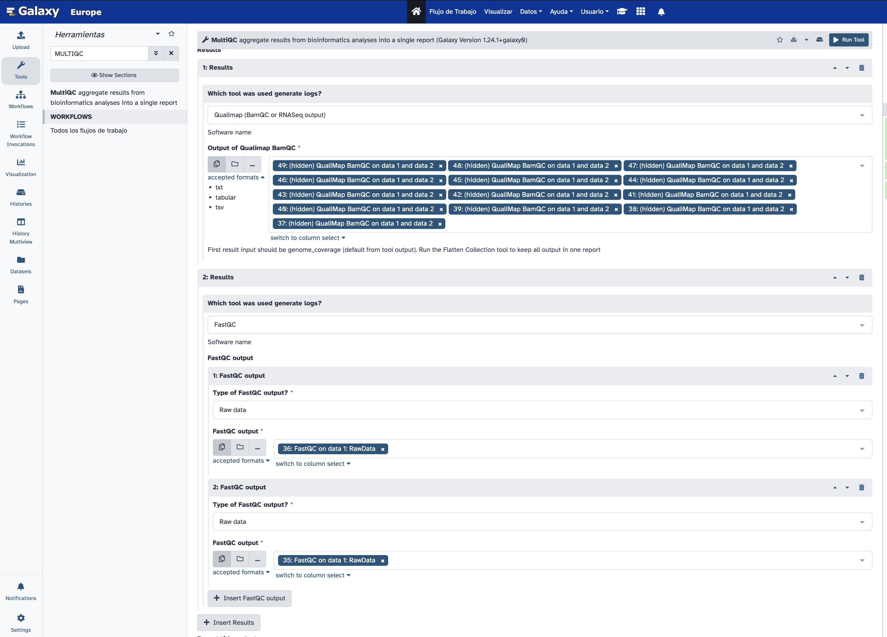

# taller_HFRZ_2024

# Práctico: Análisis de secuencias FASTQ, BAMQC y MultiQC utilizando Galaxy

En este práctico vamos a realizar un análisis básico de calidad de secuencias de lectura en formato FASTQ, seguido por un análisis de calidad de un archivo BAM utilizando BAMQC y luego recopilaremos los resultados con MultiQC para obtener un informe resumido.

## Objetivos

1. Evaluar la calidad de los archivos FASTQ utilizando **FASTQC**.
2. Realizar un control de calidad del archivo BAM con **BAMQC**.
3. Generar un reporte consolidado utilizando **MultiQC**.

## Material necesario

1. Dos archivos FASTQ comprimidos (`fastq.gz`). [(Descargar S10_R1)](CLASE1/data/S10.R1.fastq.gz)  [(Descargar S10_R2)](CLASE1/data/S10.R2.fastq.gz)  [(Descargar S9_R1)](CLASE1/data/S9.R1.fastq.gz)  [(Descargar S9_R2)](CLASE1/data/S9.R2.fastq.gz)
2. Un archivo BAM alineado. [Descargar archivo](CLASE1/data/S11.aln.bam)
3. Un archivo BED con los sitios específicos de BRCA1/2. [Descargar archivo](CLASE1/data/AmpliSeq_BRCA_hg38_new.bed)
4. Acceso a la plataforma [Galaxy](https://usegalaxy.org/). Para guardar los análisis es necesario crearse una cuenta.

---

## Procedimiento

### 1. Control de calidad de los archivos FASTQ con FASTQC

1. **Subir los archivos FASTQ**:
    - Ingresar a Galaxy y subir los archivos `fastq.gz` a tu espacio de trabajo. 
    - Para subir los archivos, haz clic en **Upload Data** y selecciona el archivo.
    
    

2. **Ejecutar FASTQC**:
    - En el panel de herramientas de Galaxy, busca **FASTQC** en la barra de búsqueda.
    - Ejecuta FASTQC para cada uno de los archivos `fastq.gz`.
    - Asegúrate de guardar los reportes generados.
      
    - Crear espacio de trabajo para cada muestra. 
      
     

3. **Visualización de resultados**:
    - Una vez que FASTQC finalice, se generarán dos reportes: uno con el análisis en formato HTML y otro en formato texto (log).
    - Visualiza los reportes y observa la calidad de las secuencias. Presta especial atención a:
        - Gráfico de calidad por posición de base.
        - Contenido GC.
        - Duplicación de secuencias.
          

### 2. Control de calidad del archivo BAM con BAMQC

1. **Subir el archivo BAM y BED**:
    - Sube el archivo `bam` y el archivo `bed` que contiene los sitios de interés (BRCA1/2).
    
2. **Ejecutar BAMQC**:
    - Busca **BAMQC** en el panel de herramientas de Galaxy.
    - Configura BAMQC para ejecutar el análisis utilizando el archivo `bam` y selecciona el archivo `bed` correspondiente a BRCA1/2 para analizar los sitios específicos.
    - Ejecuta la herramienta.
    

    

3. **Visualización de resultados**:
    - Una vez que el análisis haya finalizado, revisa el informe generado por BAMQC. En este análisis, podrás observar la cobertura en los sitios de BRCA1/2 y otros parámetros relevantes del alineamiento.
      

### 3. Consolidación de reportes con MultiQC

1. **Ejecutar MultiQC**:
    - Luego de ejecutar FASTQC y BAMQC, vamos a utilizar **MultiQC** para generar un reporte combinado.
    - Busca **MultiQC** en el panel de herramientas de Galaxy.
    - Selecciona los resultados de FASTQC y BAMQC para incluir en el informe final.
    - Importamos archivos de FASTQC (S9 y S10) y BAMQC al Modulo MULTIQC
     
     
    - Ejecuta MultiQC. Agregamos reportes de FASTQ y BAMQC
      

2. **Revisión del informe final**:
    - Una vez finalizado el proceso, visualiza el reporte generado por MultiQC.
    - Este reporte incluirá una vista consolidada de los controles de calidad realizados en los archivos FASTQ y BAM.
      

---

## Discusión de Resultados

Para profundizar en los resultados obtenidos en el análisis, responde las siguientes preguntas:

1. **¿Cuál fue el porcentaje de lecturas con calidad superior a Q30 en los archivos FASTQ?**  
   Analiza cuántas de las lecturas presentan una calidad alta (Q30 o superior) según el reporte de FASTQC. Explica si este porcentaje es adecuado para el análisis posterior.

2. **¿El contenido GC de las secuencias está dentro de los rangos esperados?**  
   Compara el contenido GC del reporte FASTQC con los valores esperados para tu muestra. ¿Podrías explicar alguna desviación significativa en el contenido GC?

3. **¿Cuántas lecturas se duplicaron según FASTQC?**  
   Revisa el reporte de duplicación de secuencias. ¿Qué porcentaje de lecturas son duplicadas y cómo puede esto afectar el análisis posterior?

5. **¿Qué porcentaje de lecturas se alinearon correctamente en el archivo BAM?**  
   Analiza el porcentaje de lecturas alineadas en el archivo BAM utilizando BAMQC. ¿El porcentaje de lecturas alineadas es suficiente para considerar confiable el mapeo?

6. **¿Cómo es la cobertura promedio de los sitios BRCA1/2 en el archivo BAM?**  
   Según BAMQC, ¿qué cobertura promedio observaste en las regiones de interés del gen BRCA1/2? ¿Es adecuada para un análisis de variantes?

7. **¿Qué porcentaje de bases está cubierto con al menos 30 lecturas en los sitios BRCA1/2?**  
   Investiga la cobertura de bases en los sitios críticos. ¿El porcentaje de bases cubiertas con al menos 30 lecturas es suficiente para detectar mutaciones de forma confiable?

9. **¿Observaste adaptadores de secuenacion en las muestras?**
    En caso que se hayan encontrado, esto podría afectar la calidad de los resultados.

11. **¿Cómo se compara el reporte consolidado de MultiQC con los resultados individuales de FASTQC y BAMQC?**  
    Revisa el informe de MultiQC. ¿Los resultados son coherentes con los reportes individuales de FASTQC y BAMQC? ¿Qué información adicional ofrece el reporte consolidado?

---

## Recursos útiles

- [Manual de Galaxy](https://galaxyproject.org/learn/)
- [Documentación de FASTQC](https://www.bioinformatics.babraham.ac.uk/projects/fastqc/)
- [MultiQC Documentation](https://multiqc.info/)
