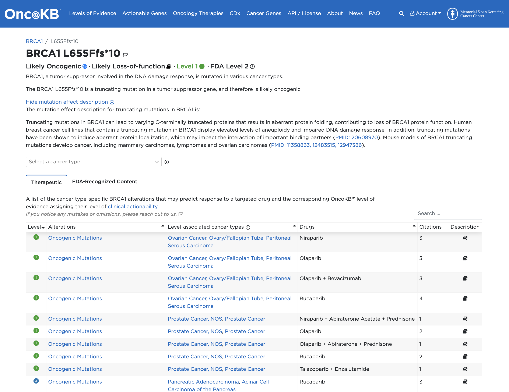

# Práctico: **Anotación de Variantes con CGI, ANNOVAR Online y OncoKB**

---

## **Objetivo**  
En este práctico, utilizarás tres herramientas diferentes para anotar variantes a partir de un archivo **VCF**: **Cancer Genome Interpreter (CGI)**, **ANNOVAR Online**, y **OncoKB**. Esto permitirá identificar variantes relevantes y su impacto clínico en cáncer.

---

## **Parte 1: Anotación de Variantes con Cancer Genome Interpreter (CGI)**

### **¿Qué es Cancer Genome Interpreter (CGI)?**  
CGI es una herramienta bioinformática que ayuda a interpretar variantes somáticas y germinales relacionadas con el cáncer. Proporciona información sobre el impacto funcional y clínico de las variantes, y las conecta con biomarcadores conocidos y terapias dirigidas.

---

### **Paso a Paso: Anotación en CGI**  

1. **Acceder a CGI**  
   - Dirígete a [https://www.cancergenomeinterpreter.org](https://www.cancergenomeinterpreter.org).  
   - Crea una cuenta o inicia sesión.  

2. **Subir el archivo VCF**    
   - Haz clic en **"Add file +"** y selecciona tu archivo **VCF**.  
   - Configura las opciones de anotación que se observan en la imagen y haz clic en **"Run"**.
     
   - Se iniciará la anotación de la variantes presentes en el archivo VCF
     

3. **Revisar y Exportar Resultados**  
   - Revisa el informe generado: impacto funcional, relevancia clínica y terapias asociadas.  
   - Descarga el los resulttados y cargalos en **Excel** para documentar.
     
     

---

## **Parte 2: Anotación de Variantes con ANNOVAR Online**

### **¿Qué es ANNOVAR?**  
**ANNOVAR** es una herramienta versátil que permite la anotación de variantes genéticas utilizando múltiples bases de datos, como ClinVar, gnomAD, y REVEL. Es ideal para identificar variantes con relevancia clínica o funcional.

---

### **Paso a Paso: Anotación en wANNOVAR**

1. **Acceder a wANNOVAR**  
   - Visita [wANNOVAR](http://wannovar.wglab.org/).  

2. **Subir el archivo VCF**  
   - En la página principal, haz clic en **"Choose File"** y selecciona tu archivo **VCF**.  
   - Configura las opciones de anotación:  
     - Selecciona las bases de datos que deseas usar (ClinVar, gnomAD, REVEL, etc.).  
     - Especifica el formato de salida.  
   - Haz clic en **"Run ANNOVAR"**.
     
     
     

3. **Revisar y Descargar Resultados**  
   - Una vez finalizado el análisis, revisa las variantes anotadas.  
   - Descarga los resultados en formato **Excel** o **CSV**.  
     
     
     

---

## **Parte 3: Anotación de Variantes Patogénicas con OncoKB**

### **¿Qué es OncoKB?**  
**OncoKB** es una base de datos de conocimiento de oncología de precisión que clasifica variantes genéticas en función de su relevancia clínica, desde biomarcadores predictivos hasta variantes sin impacto conocido.

---

### **Paso a Paso: Identificación de Variantes en OncoKB**

1. **Acceder a OncoKB**  
   - Ingresa a [https://www.oncokb.org](https://www.oncokb.org).  
   - Crea una cuenta o inicia sesión.  

2. **Buscar Variantes Anotadas**  
   - Utiliza las variantes identificadas previamente en **CGI** o **ANNOVAR**.  
   - Ingresa cada variante en la barra de búsqueda de OncoKB.
     

3. **Revisar la Clasificación Clínica**  
   - OncoKB clasifica las variantes en diferentes niveles:  
     - **Terapéuticamente accionables** (niveles 1-4).  
     - **De relevancia diagnóstica o pronóstica**.  
     - **Sin impacto clínico conocido**.
       
       

4. **Documentar los Resultados**  
   - Guarda capturas de pantalla o exporta los resultados relevantes.  

---

## **Preguntas para Reflexión**  
1. ¿Cuáles son las diferencias en los resultados obtenidos entre CGI, ANNOVAR y OncoKB?  
2. ¿Qué variantes se clasificaron como clínicamente relevantes?  
3. ¿Cómo podrían estos hallazgos influir en decisiones terapéuticas o diagnósticas?

---

**Nota**: Recuerda agregar capturas de pantalla de cada paso para facilitar el seguimiento del práctico.
